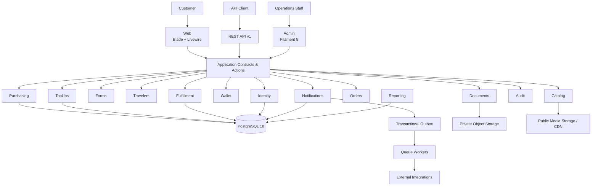
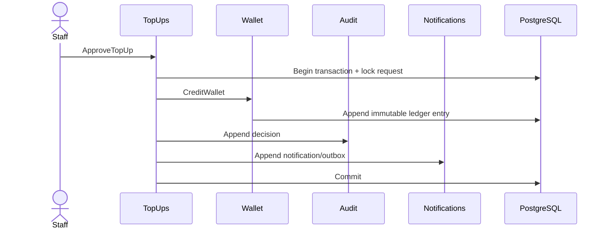
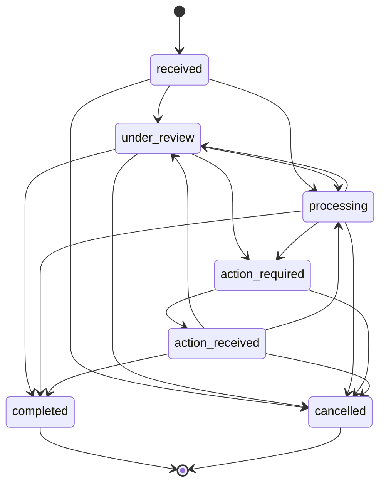
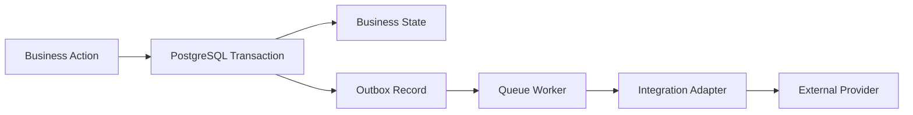

<div align="center">

# Rehla Platform

> **Rehla Platform — Modular Monolith Architecture**

### A package-based Laravel platform for travel-service commerce, wallet payments, customer journeys, and operational fulfillment.

**Modular Monolith · Laravel 13 · PHP 8.5 · PostgreSQL 18 · Livewire · Filament 5 · REST API**

<br>

[](#architecture)
[](https://laravel.com/)
[](https://www.php.net/)
[](https://www.postgresql.org/)
[](#rest-api)
[](#project-status)

<br>

**Customer Web** · **REST API** · **Operations Admin** · **Wallet** · **Top-Ups** · **Orders** · **Service Fulfillment**

[Project Concept & User Journey](REHLA-PROJECT-CONCEPT-AND-USER-JOURNEY.md)
·
[Implementation Plan](superpowers/plans/2026-09-11-rehla-platform-build.md)
·
[Architecture Maps](architecture/rehla-package-map.json)

</div>

---

## Overview

**Rehla** is designed as a single Laravel application with strongly enforced package boundaries.

The platform separates customer identity, travelers, catalog, forms, private documents, wallet accounting, top-ups, purchasing, orders, operational fulfillment, notifications, audit, reporting, integrations, customer-facing web, REST API, and administration into local Composer packages under:

```text
packages/Rehla/<Package>
```

The objective is not to simulate microservices inside one repository. The objective is to keep business ownership explicit while preserving the transactional consistency, deployment simplicity, and operational efficiency of a modular monolith.

> **Architecture principle:** one deployable Laravel application, one PostgreSQL database, clear package ownership, explicit contracts, and no hidden cross-domain writes.

---

## Project Status

> [!IMPORTANT]
> Rehla is currently defined by a **target architecture and implementation plan**.  
> The package structure and application foundation described here are the intended design and must not be interpreted as already implemented unless confirmed by the repository state.

The current build plan contains:

- **7 ordered implementation plans**
- **34 implementation tasks**
- RED → GREEN development cycles
- architectural, security, PostgreSQL, API, browser, and end-to-end verification gates
- requirement traceability across **R01–R65**

The executable build plan is maintained in:

**[`superpowers/plans/2026-09-11-rehla-platform-build.md`](superpowers/plans/2026-09-11-rehla-platform-build.md)**

---

## Why Rehla Exists

Rehla models a service-purchasing journey where a customer can:

1. create an account,
2. manage one or more travelers,
3. browse published services,
4. complete a versioned application form,
5. upload private supporting documents,
6. fund a wallet through reviewed bank-transfer top-ups,
7. submit a service order,
8. pay atomically from the wallet,
9. track operational fulfillment,
10. respond to additional customer-action requests,
11. receive notifications throughout the journey.

The architecture deliberately separates the **commercial record** from the **operational execution** so that payment history remains immutable while fulfillment can evolve through its own controlled state machine.

---

## Architecture



### Architectural style

Rehla uses a **Modular Monolith**:

- one Laravel application,
- one primary PostgreSQL database,
- local Composer packages as business boundaries,
- one owner per table,
- explicit package contracts,
- cross-package writes only through public application contracts,
- shared transactions where business invariants require atomicity,
- asynchronous work only after durable state is committed.

Packages are architectural boundaries—not deployment units.

---

## Technology

| Layer | Decision |
|---|---|
| Framework | Laravel 13.x |
| Runtime | PHP 8.5 |
| Database | PostgreSQL 18 |
| Customer Web | Blade + Livewire |
| Admin | Filament 5 |
| API | REST `/api/v1` + OpenAPI 3.1 |
| Authentication | Laravel sessions + Sanctum where API tokens are required |
| Authorization | Gates, Policies, fine-grained abilities, deny-by-default |
| Queue | Laravel Queue |
| Reliable async delivery | PostgreSQL transactional Outbox |
| Customer locale | English default, Arabic + RTL supported |
| Private storage | Protected object/file storage |
| Public storage | Separate public media disk / CDN |
| Tests | Pest or PHPUnit + real PostgreSQL integration tests |
| Agent support | Laravel Boost + repository-local architecture rules |

Redis, GraphQL, Horizon, and external workflow engines are **not architectural defaults**. They are introduced only when a measured requirement justifies them.

---

## Repository Layout

```text
rehla3/
├── app/
│   └── Providers/
├── bootstrap/
├── config/
├── database/
│   └── seeders/
├── lang/
│   ├── en/
│   └── ar/
├── packages/
│   └── Rehla/
│       ├── Core/
│       ├── Identity/
│       ├── Catalog/
│       ├── Forms/
│       ├── Travelers/
│       ├── Documents/
│       ├── Wallet/
│       ├── TopUps/
│       ├── Orders/
│       ├── Fulfillment/
│       ├── Purchasing/
│       ├── Notifications/
│       ├── Content/
│       ├── Audit/
│       ├── Reporting/
│       ├── Integrations/
│       ├── Web/
│       ├── Api/
│       └── Admin/
├── resources/
├── routes/
├── tests/
│   ├── Architecture/
│   ├── EndToEnd/
│   └── Support/
├── architecture/
│   ├── rehla-package-map.json
│   ├── rehla-package-contract-map.json
│   └── table-ownership.json
├── composer.json
├── composer.lock
└── phpunit.xml
```

Each domain package owns its own Composer metadata, namespace, migrations, tests, documentation, and public contracts.

---

## Package Map

| Package | Responsibility |
|---|---|
| `Core` | Shared value objects and domain-neutral primitives |
| `Identity` | Customer accounts, staff, roles, abilities |
| `Catalog` | Services, pricing, requirements, media, fulfillment policy versions |
| `Forms` | Draft and immutable published service forms |
| `Travelers` | Traveler ownership and passport normalization |
| `Documents` | Private/public document metadata, scanning, lifecycle, access |
| `Wallet` | Wallet balances, immutable ledger, reconciliation |
| `TopUps` | Bank accounts, minimum top-up settings, transfer review |
| `Orders` | Immutable commercial record and historical snapshots |
| `Purchasing` | Atomic order-submission orchestration and idempotency |
| `Fulfillment` | Operational service execution and state transitions |
| `Notifications` | In-app notifications and transactional Outbox |
| `Content` | Public website content |
| `Audit` | Append-only sensitive decision trail |
| `Reporting` | Read models and product/operations metrics |
| `Integrations` | External channel/provider adapters |
| `Web` | Customer storefront and account experience |
| `Api` | Versioned REST API and OpenAPI contract |
| `Admin` | Filament operations interface |

### Package boundary rules

The following rules are mandatory:

- `Core` imports no Rehla package.
- Business packages never import `Web`, `Api`, or `Admin`.
- UI packages never perform direct business-table writes.
- A package never mutates another package's Eloquent model.
- Public boundaries use `Contracts`, DTOs, typed IDs, and immutable values.
- Every table has exactly one owning package.
- Cross-package foreign keys are allowed; cross-package direct writes are not.
- Architectural dependency cycles fail CI.
- `Reporting` is read-only.
- Business logic must not be hidden behind service locators or facades.
- New dependency edges require an explicit architecture update.

Machine-readable architecture sources:

- [`architecture/rehla-package-map.json`](architecture/rehla-package-map.json)
- [`architecture/rehla-package-contract-map.json`](architecture/rehla-package-contract-map.json)
- [`architecture/table-ownership.json`](architecture/table-ownership.json)

---

## Inside a Business Package

Packages begin small and add structure only when needed.

```text
packages/Rehla/TopUps/
├── composer.json
├── README.md
├── src/
│   ├── Providers/
│   ├── Actions/
│   ├── Queries/
│   ├── Contracts/
│   ├── Data/
│   ├── Domain/
│   ├── Models/
│   ├── Enums/
│   ├── Events/
│   ├── Exceptions/
│   ├── Policies/
│   ├── Infrastructure/
│   ├── config/
│   ├── database/
│   └── resources/
└── tests/
    ├── Unit/
    ├── Feature/
    ├── Integration/
    └── Architecture/
```

Typical public contracts are intentionally small and outcome-oriented:

```text
Catalog        → GetCurrentServiceQuote
Forms          → GetPublishedForm
Forms          → ValidateFormSubmission
Travelers      → GetOwnedTravelerSnapshot
Documents      → ValidateOwnedDocuments
Wallet         → CreditWallet
Wallet         → DebitWallet
Orders         → CreatePaidOrder
Fulfillment    → CreateExecution
Fulfillment    → TransitionExecution
Audit          → AppendAuditEntry
Notifications  → AppendOutboxMessage
```

---

## Critical Business Flows

### Customer registration

Registration is one synchronous transaction:

```text
Create Account
    ↓
Append Audit
    ↓
Initialize Wallet
    ↓
Record Welcome Notification / Outbox
    ↓
Commit
```

A failure rolls back the account, wallet initialization, audit entry, notification, and Outbox state together.

No external network I/O occurs before commit.

---

### Wallet top-up approval



Key invariants:

- top-up approval is idempotent,
- one approved top-up creates one credit entry,
- wallet ledger entries are append-only,
- duplicate bank/reference combinations are prevented at database level,
- rejection never mutates wallet balance.

---

### Order submission

`Purchasing/Actions/SubmitOrder` owns the purchase transaction.

```text
Authenticate customer
    ↓
Claim / validate Idempotency-Key
    ↓
Lock wallet + authoritative service/form state
    ↓
Validate service availability + accepted price
    ↓
Validate published form version + answers
    ↓
Validate traveler ownership
    ↓
Validate clean owned documents
    ↓
Debit wallet
    ↓
Create immutable Order snapshots
    ↓
Create Fulfillment execution
    ↓
Append Audit + Notification Outbox
    ↓
Store idempotent result
    ↓
Commit
```

### Purchasing guarantees

- no order is created when a form is merely opened,
- no wallet hold is created while the user fills a form,
- client-provided price, ownership, IDs, and form version are treated as claims and revalidated,
- repeated matching idempotent requests return the same order,
- reusing an idempotency key with a different payload returns `409`,
- order creation and wallet debit succeed or fail together,
- external messages are never sent from inside the purchase transaction.

---

## Commercial Record vs. Operational Execution

Rehla intentionally separates:

```text
Order
└── immutable commercial history
    ├── paid price
    ├── currency
    ├── wallet debit reference
    ├── service snapshot
    ├── traveler snapshot
    └── historical schema/version references

Execution
└── mutable operational process
    ├── status
    ├── customer responses
    ├── internal notes
    ├── action requests
    ├── issued documents
    └── transition history
```

This prevents operational corrections from rewriting commercial history.

---

## Fulfillment State Machine

The platform uses separate enums for Top-Ups, Orders, and Executions.



Individual services can add published SOP/policy constraints over this standard transition set.

---

## Money & Wallet Integrity

Financial state is deliberately strict.

- Money is stored as integers in the smallest supported SDG unit.
- `float` is forbidden for prices, wallet entries, and balances.
- Ledger entries are append-only.
- Corrections create reversing entries instead of mutating history.
- Cached wallet balance, when used, changes in the same transaction as its ledger entry.
- Database constraints protect against invalid balances and logical duplicates.
- Reconciliation validates wallet balance against ledger history.
- Financial concurrency tests run on real PostgreSQL—not SQLite.

---

## Documents & Private Files

Rehla treats customer documents as protected data.

```text
pending_scan
    ↓
quarantined
   ↙     ↘
clean   rejected
  ↓
attached
```

Private-file controls include:

- MIME detection from content,
- size limits,
- magic-byte validation,
- image decoding checks,
- malware scanning,
- ownership validation,
- private storage,
- short-lived authorized download access,
- safe `Content-Disposition`,
- `X-Content-Type-Options: nosniff`,
- no permanent public URL for passports, receipts, or support documents.

Public service images and bank logos live on a separate public disk.

---

## REST API

The first API contract is versioned under:

```text
/api/v1
```

Representative endpoints:

```http
POST   /api/v1/auth/register
POST   /api/v1/auth/login
POST   /api/v1/auth/logout

GET    /api/v1/me
PATCH  /api/v1/me

GET    /api/v1/services
GET    /api/v1/services/{service_slug}
GET    /api/v1/services/{service_slug}/application-form

GET    /api/v1/travelers
POST   /api/v1/travelers
GET    /api/v1/travelers/{traveler_id}
PATCH  /api/v1/travelers/{traveler_id}

GET    /api/v1/wallet
GET    /api/v1/wallet/entries

GET    /api/v1/top-ups
POST   /api/v1/top-ups
PUT    /api/v1/top-ups/{top_up_id}/receipt

POST   /api/v1/uploads
GET    /api/v1/documents/{document_id}/content

POST   /api/v1/order-submissions
GET    /api/v1/orders
GET    /api/v1/orders/{order_reference}

POST   /api/v1/executions/{execution_id}/actions/{action_request_id}/responses

GET    /api/v1/notifications
POST   /api/v1/notifications/{notification_id}/read
```

### API rules

- `POST /order-submissions` requires `Idempotency-Key`.
- OpenAPI 3.1 is the contract source.
- Controllers do not read or write business tables directly.
- Customer ownership is derived from authenticated identity—not request payload.
- Object-level access is Policy-controlled.
- Errors use `application/problem+json`.
- Error codes are stable and machine-readable.
- Authentication, upload, and purchase endpoints use stricter rate limits.

Example error codes:

```text
wallet.insufficient_balance
service.price_changed
traveler.passport_conflict
top_up.reference_used
idempotency.key_reused
```

---

## Web Experience

The customer web application provides:

### Public

- Home
- Service catalog
- Service details
- Published requirements
- WhatsApp inquiry entry point

### Customer account

- Profile
- Travelers
- Wallet
- Wallet history
- Top-up requests
- Orders
- Service execution status
- Customer action requests
- Notifications

English is the default locale. Arabic and RTL are first-class supported experiences.

---

## Admin Operations

The Filament-based operations panel covers:

| Area | Primary responsibility |
|---|---|
| Overview | Operational/product indicators |
| Services | Catalog management |
| Application Forms | Drafting and publishing immutable form versions |
| Customers | Support-safe account visibility |
| Travelers | Controlled traveler lookup |
| Wallets | Read-only financial history by default |
| Bank Accounts | Funding destination configuration |
| Top-Up Requests | Review, approve, reject |
| Orders | Immutable commercial record |
| Service Executions | Operational workflow |
| Content | Public content management |
| Notifications | Delivery/replay operations |
| Roles & Permissions | Fine-grained access control |
| Audit Log | Sensitive decision history |

Admin resources may use read-only read models, but all mutations must call the owning package's application actions.

No Filament action may directly debit a wallet, approve a transfer, rewrite an order snapshot, or mutate another package's model.

---

## Authentication & Authorization

Security follows **deny-by-default**.

- Customer Web and Admin use separate sessions.
- Admin uses a separate guard/cookie/lifetime policy.
- Sanctum is used for API clients when token-based access is enabled.
- Staff permissions are represented as fine-grained abilities.
- Sensitive financial/access operations require stronger authentication controls.
- Customer queries are scoped from authenticated identity.
- IDs supplied by clients never imply ownership.
- Sensitive document access is separately authorized.
- Audit records capture actor, time, reason, and correlation context.
- Application secrets never belong in source control.

---

## Reliable Notifications & Integrations

External delivery uses a transactional Outbox.



The system guarantees durable **at-least-once** processing—not fictional exactly-once delivery.

Outbox processing uses:

- `available_at`
- `locked_at`
- `locked_by`
- `lock_token`
- `lease_expires_at`
- `attempts`
- `delivered_at`
- `deduplication_key`
- payload versioning

A stale worker cannot acknowledge a message after another worker has reclaimed it.

---

## Auditability

Sensitive operations generate append-only audit history, including:

- access-control changes,
- top-up approval/rejection,
- wallet-affecting operations,
- fulfillment transitions,
- sensitive document access,
- administrative actions requiring accountability.

Audit and financial ledger records are protected against normal `UPDATE` and `DELETE` paths at both application and database levels.

---

## Testing Strategy

Rehla treats architecture and concurrency as executable requirements.

| Test Layer | Purpose |
|---|---|
| Unit | Money, normalization, state machines, pure rules |
| Feature | Actions, Queries, Policies, validation |
| PostgreSQL Integration | locks, uniqueness, rollback, triggers, concurrency |
| API Contract | OpenAPI, auth, errors, idempotency |
| Web/Admin Feature | Livewire, requests, Filament, abilities |
| Browser E2E | customer/admin journeys, EN/AR/RTL, accessibility |
| Architecture | package direction, ownership, forbidden imports |
| Security | cross-account isolation, private files, mass assignment, rate limits |

### Mandatory database-testing rules

Financial and purchasing tests:

- run on PostgreSQL,
- reject production-like database configuration,
- use independent connections/processes for concurrency tests,
- include failure injection after wallet debit, after order creation, and before execution creation,
- prove complete transaction rollback,
- test database constraints and triggers directly—not only through Eloquent.

---

## Quality Gates

A release is not considered valid because unit tests pass.

The build pipeline is expected to cover:

```text
Formatter
    ↓
Static Analysis
    ↓
Composer Audit
    ↓
Architecture Tests
    ↓
Unit / Feature Tests
    ↓
PostgreSQL Integration & Concurrency
    ↓
API Contract Tests
    ↓
Frontend Build
    ↓
Browser / End-to-End Tests
    ↓
Security Gates
```

Tests inside `packages/Rehla/*` must be discovered and executed explicitly.

---

## Observability

HTTP requests and queued jobs carry:

```text
trace_id
correlation_id
```

Where:

- `trace_id` identifies one HTTP request or one queued-job attempt,
- `correlation_id` follows one logical business operation across retries, audit, notifications, and Outbox delivery.

Operational telemetry includes:

- top-up review duration,
- fulfillment duration,
- Outbox depth,
- queue depth,
- delivery failures,
- transaction conflicts,
- reconciliation failures,
- repeated job failures,
- HTTP 5xx rates.

---

## Deployment Model

Initial runtime components:

```text
Web / PHP Application
Queue Worker
Scheduler
PostgreSQL
Private Object Storage
Public Asset Storage / CDN
```

Deployment follows:

```text
Pre-deploy checks
    ↓
Expand migrations
    ↓
Deploy immutable application artifact
    ↓
Gracefully restart workers
    ↓
Run safe backfills
    ↓
Post-deploy smoke tests
    ↓
Contract migrations in a later release
```

Schema evolution follows **expand → migrate/backfill → contract**.

Rollback restores an application artifact or disables a feature. It does not depend on reversing destructive migrations after new code has already used them.

---

## Product Metrics

`Reporting` defines explicit metric contracts before dashboards are built.

Initial metrics include:

- registered users,
- traveler profiles,
- paid order count,
- paid order value,
- top-up completion rate,
- top-up review duration,
- top-up approval/rejection ratio,
- orders by service,
- fulfillment duration,
- customer-action volume,
- execution completion rate,
- traveler reuse,
- repeat customer / retention metrics.

Each metric has a documented source, time semantics, timezone, and numerator/denominator when applicable.

---

## Scope Boundaries

The first version intentionally does **not** introduce:

```text
Cart
Inventory
Shipping
Marketplace
Multi-currency
Refunds
Generic workflow engine
GraphQL
Microservices
```

These concepts must not be introduced by convenience or agent speculation.

Future capabilities are added only after a product requirement defines them and the architecture identifies the correct ownership boundary.

---

## Future Extension Paths

| Future capability | Expected extension point |
|---|---|
| New service / destination | Catalog + Forms + Fulfillment policy |
| Additional traveler identity data | Travelers |
| New funding/payment method | TopUps + Wallet contracts |
| Government / visa provider | Integrations adapter |
| Loyalty / promotions | New package consuming Catalog/Purchasing contracts |
| Ratings | Independent package |
| CRM / support | Dedicated Support/CRM package |
| Refunds | Dedicated Refunds package with new Wallet entries |
| Advanced analytics | Reporting read models |

A package can be extracted into an independent service only when operational evidence justifies the cost and an explicit versioned API/event consistency model has been designed.

---

## Forbidden Patterns

The following patterns violate the Rehla architecture:

```text
✗ Floating-point money
✗ Direct cross-package model mutation
✗ Business logic in controllers
✗ Business logic in Livewire components
✗ Business logic in Filament resources
✗ Wallet mutations from observers
✗ Hidden global events that create Orders
✗ Sending HTTP/email/WhatsApp inside financial transactions
✗ Permanent public URLs for private documents
✗ Trusting client account_id, price, ownership, or role claims
✗ Creating an Order when a form is opened
✗ Creating an Order when an upload is created
✗ Mixing TopUp, Order, and Execution statuses
✗ Mutating ledger history
✗ Mutating published form versions
✗ Mutating historical Order snapshots
✗ Turning Core into a generic Helpers/Common dumping ground
```

---

## Requirement Traceability

The architecture maps the project concept across **R01–R65**.

Coverage means **architecturally mapped**, not implemented.

The implementation process must break multi-part requirements into atomic acceptance IDs and attach concrete evidence before marking them complete.

Examples of evidence include:

- passing architecture tests,
- PostgreSQL concurrency tests,
- API contract tests,
- browser E2E tests,
- direct SQL immutability tests,
- security isolation tests,
- implementation commits,
- deployment verification.

---

## Architecture Acceptance

The architecture is considered implemented only when:

- package ownership and dependency boundaries exist in code,
- architecture tests reject cycles and forbidden imports,
- financial, top-up, and purchasing invariants pass PostgreSQL concurrency/failure tests,
- Web, API, and Admin reuse the same application actions,
- private documents have no permanent public access path,
- OpenAPI and HTTP tests agree on the API v1 contract,
- customer/admin browser journeys pass in the required locales,
- every R01–R65 requirement has implementation evidence or a documented scope decision.

---

## Documentation

Start here:

| Document | Purpose |
|---|---|
| [`REHLA-PROJECT-CONCEPT-AND-USER-JOURNEY.md`](REHLA-PROJECT-CONCEPT-AND-USER-JOURNEY.md) | Product concept and end-to-end user journey |
| [`superpowers/plans/2026-09-11-rehla-platform-build.md`](superpowers/plans/2026-09-11-rehla-platform-build.md) | Ordered implementation plan |
| [`architecture/rehla-package-map.json`](architecture/rehla-package-map.json) | Machine-readable allowed dependency map |
| [`architecture/rehla-package-contract-map.json`](architecture/rehla-package-contract-map.json) | Public contract map per dependency edge |
| [`architecture/table-ownership.json`](architecture/table-ownership.json) | Authoritative table ownership map |

Each package also maintains its own `README.md` describing:

- what it owns,
- what it explicitly does not own,
- its database tables,
- public contracts,
- dependencies,
- invariants,
- security/privacy decisions,
- verification commands.

---

## Development Philosophy

Rehla favors:

**explicit ownership over convenience**  
**database guarantees over optimistic assumptions**  
**immutable history over destructive corrections**  
**small public contracts over shared models**  
**synchronous consistency for money over premature async workflows**  
**measured evolution over speculative infrastructure**

---

<div align="center">

### Rehla

**Clear boundaries. Durable history. Atomic money. Predictable operations.**

Built as a modular Laravel platform designed to evolve without sacrificing transactional integrity.

</div>
