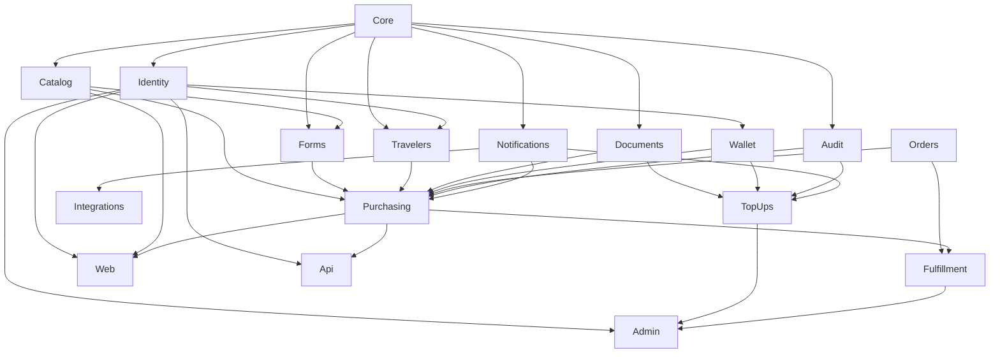

# Laravel Package-Based Architecture for the "Rihla" Project

This document is the proposed architectural contract for implementing the requirements defined in [Rihla Project Concept and User Journey](REHLA-PROJECT-CONCEPT-AND-USER-JOURNEY.md) using Laravel. It covers the first release, the Web and REST API interfaces, the administration panel, package boundaries, data ownership, transactions, authorization, storage, jobs, testing, and future expansion.

Document status: **Foundation and Core are implemented; implementation plans 02 through 10 remain planned.**

Full executable build plan: [Rehla Platform Implementation Plan](superpowers/plans/2026-09-11-rehla-platform-build.md), consisting of ten ordered implementation plans and 51 tasks with RED/GREEN cycles and verification gates.

## 1. Architectural Decision

Rihla is built as a single **Modular Monolith** application on Laravel, using one PostgreSQL database. Business domains and interfaces are placed in independent local Composer packages under:

```text
packages/Rehla/<Package>
```

A package is the boundary of ownership, understanding, and testing. Packages do not imply Microservices, and each package does not own a separate database or deployment process. The packages share the Laravel application and the same database transaction whenever Rihla's business rules require it.

We chose `packages` because the project has stable boundaries between account, traveler, service, wallet, top-up, order, and fulfillment. This organization provides:

- A `composer.json`, namespace, tests, and README for each domain.
- Declared dependencies between packages that can be checked automatically.
- A limited change surface for coding agents.
- The ability to extract a package later if a real operational reason appears.
- Prevention of Web, API, and Admin interfaces from owning business logic.

Laravel does not impose this organization; Composer supports loading it. Therefore, these boundaries must be enforced by architecture tests, not by folders alone. [Laravel directory structure](https://laravel.com/framework/docs/13.x/structure).

## 2. Core Technology

| Layer | Decision |
|---|---|
| Framework | Laravel 13.x with a specific patch version pinned in `composer.lock` |
| Runtime | PHP 8.5 within the support range of the selected release |
| Database | PostgreSQL 18, with a real PostgreSQL test instance |
| Customer Web | Blade + Livewire, Laravel sessions, EN by default and AR/RTL |
| REST API | JSON API versioned under `/api/v1` with OpenAPI 3.1 documentation |
| Admin | Filament 5, calling the same application commands |
| Authentication | Session for Web and Admin; Sanctum for API clients when enabled |
| Authorization | Gates/Policies with fine-grained abilities; deny-by-default |
| Queue | Laravel Queue with an Outbox persisted in PostgreSQL |
| Cache | Read optimization only; never a source of truth for money or authorization |
| Storage | Private disk for documents and a separate public disk for marketing images |
| Testing | Pest or PHPUnit, PostgreSQL, integration, HTTP, and browser tests |
| Agent support | Laravel Boost and Laravel/Filament skills with Rihla-local rules |

The design does not require GraphQL, Redis, or an external Workflow engine. These components are added only when a requirement or measurement justifies them.

## 3. Repository Structure

```text
rehla3/
├── app/
│   └── Providers/
│       └── AppServiceProvider.php
├── bootstrap/
│   ├── app.php
│   └── providers.php
├── config/
├── database/
│   └── seeders/                  # Global seed orchestration only
├── lang/
│   ├── en/
│   └── ar/
├── packages/
│   └── Rehla/
│       ├── Core/
│       ├── Identity/
│       ├── Catalog/
│       ├── Forms/
│       ├── Travelers/
│       ├── Documents/
│       ├── Wallet/
│       ├── TopUps/
│       ├── Orders/
│       ├── Fulfillment/
│       ├── Purchasing/
│       ├── Notifications/
│       ├── Content/
│       ├── Audit/
│       ├── Reporting/
│       ├── Integrations/
│       ├── Web/
│       ├── Api/
│       └── Admin/
├── resources/
│   ├── css/
│   └── js/
├── routes/
│   └── console.php               # Host-level commands only
├── tests/
│   ├── Architecture/
│   ├── EndToEnd/
│   └── Support/
├── composer.json
├── composer.lock
└── phpunit.xml
```

The root `composer.json` defines a `path` repository for `packages/Rehla/*`. Every package has its own `composer.json` and PSR-4 namespace such as `Rehla\\Wallet\\`. Packages depend on the Composer package names of other packages and register their Service Providers through Laravel package discovery. This minimizes changes to centralized registration files when packages are added.

Example root contract:

```json
{
  "repositories": [
    {
      "type": "path",
      "url": "packages/Rehla/*",
      "options": { "symlink": true }
    }
  ],
  "require": {
    "rehla/web": "@dev",
    "rehla/api": "@dev",
    "rehla/admin": "@dev"
  }
}
```

Packages are not copied into `vendor` during development. CI installs dependencies from `composer.lock` without relying on files outside the repository. Every migration lives inside the package that owns the table and is loaded by that package's Service Provider. Table names are global and explicit, and two packages must never create migrations for the same table.

## 4. Packages and Responsibilities

| Package | Responsibility | Primary data it owns |
|---|---|---|
| `Core` | Domain-neutral values and utilities required by multiple domains | No business tables; `Money`, IDs, Clock, error result types |
| `Identity` | Accounts, staff, roles, and abilities | users, staff profiles, roles, abilities, assignments |
| `Catalog` | Services, prices, requirements, media, ordering, activation, and published fulfillment policies | services, service requirements, service media, price history, fulfillment policy versions |
| `Forms` | Service form drafts, published versions, and validation | form drafts, form versions, schemas/checksums |
| `Travelers` | Travelers, ownership, passport normalization, and uniqueness | travelers |
| `Documents` | File metadata, ownership, classification, and private/public storage | documents, upload sessions, retention state |
| `Wallet` | Wallets, balances, immutable ledger entries, and reconciliation | wallets, wallet ledger entries, reconciliation runs |
| `TopUps` | Banks, minimum top-up configuration, transfer requests, and review | bank accounts, top-up settings, top-up requests, receipt links |
| `Orders` | Immutable commercial record and purchase snapshots | orders, service/traveler/price snapshots, debit reference |
| `Fulfillment` | Service execution, states, responses, and customer action requests | executions, responses, status history, notes, action requests, document links |
| `Purchasing` | Order-submission orchestration, idempotency, and shared transaction | purchase attempts/idempotency records |
| `Notifications` | In-app notifications, Outbox, and delivery attempts | outbox messages, outbox delivery attempts, in-app notifications |
| `Content` | Public website pages and content | pages, localized content |
| `Audit` | Immutable record of sensitive decisions | audit entries |
| `Reporting` | Reads and metrics for section 62 | read models or materialized views; does not write source records |
| `Integrations` | Adapters for external channels and providers | provider credential references, delivery/provider logs when needed |
| `Web` | Storefront and customer account via Blade/Livewire | Owns no business data |
| `Api` | REST API v1, resources, OpenAPI, and error mapping | Owns no business data |
| `Admin` | Filament operations panel and authorization | Owns no business data |

`Purchasing` is a Process package, not a commerce catalog. Its existence prevents `Orders` and `Wallet` from depending on each other in both directions and gives the atomic purchase operation a single owner.

`Purchasing` defines the `ExecutionCreator` contract required by `SubmitOrder`, and `Fulfillment` implements it. Therefore, Fulfillment has a build-time dependency on Purchasing, while Purchasing calls the contract it owns without importing Fulfillment. Fulfillment's Service Provider registers the runtime binding. This Dependency Inversion prevents a Composer cycle while preserving the shared transaction.

## 5. Structure of Each Business Package

Packages start with a flat, predictable Laravel structure and do not create empty layers:

```text
packages/Rehla/TopUps/
├── composer.json
├── README.md
├── src/
│   ├── Providers/
│   │   └── TopUpsServiceProvider.php
│   ├── Actions/                   # Write use cases
│   │   ├── SubmitTopUp.php
│   │   ├── ApproveTopUp.php
│   │   └── RejectTopUp.php
│   ├── Queries/                   # Side-effect-free reads
│   ├── Contracts/                 # Surface allowed to other packages
│   ├── Data/                      # DTOs for inputs and results
│   ├── Domain/                    # Pure rules when needed
│   ├── Models/                    # Eloquent inside the table owner
│   ├── Enums/
│   ├── Events/
│   ├── Exceptions/
│   ├── Policies/
│   ├── Infrastructure/            # Storage/provider adapters when needed
│   ├── config/
│   ├── database/
│   │   ├── factories/
│   │   ├── migrations/
│   │   └── seeders/
│   └── resources/
│       └── lang/
│           ├── en/
│           └── ar/
└── tests/
    ├── Unit/
    ├── Feature/
    ├── Integration/
    └── Architecture/
```

Complex pure rules, such as state transitions or `Money`, may live in `Domain/` inside the package. A `Repository Interface` is not added automatically for every Model; it is added when an operation crosses a package boundary, when multiple implementations exist, or when a test must isolate an external dependency.

The package root remains limited to `composer.json`, `README.md`, `src/`, and `tests/`. Package configuration, migrations, resources, routes, and OpenAPI files live under `src/`, and no directory is created unless the package needs it. `tests/` remains at the package root and is referenced by `autoload-dev`.

The Service Provider loads package resources from their actual locations under `src/`: `mergeConfigFrom` for configuration, `loadMigrationsFrom` for migrations, `loadRoutesFrom` for routes, `loadViewsFrom` for views, and `loadTranslationsFrom` for translations. Publishing to the host application is limited to customizable resources and does not change package ownership.

Every package `README.md` defines:

- What the package owns and what it does not own.
- Its tables and public interfaces.
- The packages it depends on and why.
- Public commands, queries, and events.
- Invariants and test commands.
- Package-specific security and privacy decisions.

Critical public surfaces remain small and are named by outcome, for example:

```text
Catalog:       GetCurrentServiceQuote
Forms:         GetPublishedForm + ValidateFormSubmission
Travelers:     GetOwnedTravelerSnapshot
Documents:     ValidateOwnedDocuments
Wallet:        CreditWallet + DebitWallet
Orders:        CreatePaidOrder
Fulfillment:   CreateExecution + TransitionExecution
Audit:         AppendAuditEntry
Notifications: AppendOutboxMessage
```

These contracts return Data objects, identifiers, and immutable values. They do not return mutable Models to another package. `Purchasing` composes them in `SubmitOrder`, while `TopUps` uses only the `CreditWallet` contract.

## 6. Dependency Rules



The arrows mean "provides a dependency to the consumer." For example, `Catalog --> Purchasing` means `Purchasing` depends on the public surface of `Catalog`. The diagram shows the most important write paths; the following table is the authoritative reference for all allowed dependencies:

| Consumer | Packages it is allowed to depend on |
|---|---|
| Core | None from Rehla |
| Audit | Core |
| Identity | Core, Audit |
| Documents | Core, Identity, Audit |
| Travelers | Core, Identity, Audit |
| Wallet | Core, Identity, Audit |
| Notifications | Core, Identity, Audit |
| Catalog | Core, Documents, Audit |
| Forms | Core, Catalog, Audit |
| Content | Core, Audit |
| TopUps | Core, Identity, Documents, Wallet, Audit, Notifications |
| Orders | Core |
| Purchasing | Core, Identity, Catalog, Forms, Travelers, Documents, Wallet, Orders, Audit, Notifications |
| Fulfillment | Core, Identity, Orders, Forms, Documents, Purchasing, Audit, Notifications |
| Integrations | Core, Notifications |
| Reporting | Core, Identity, Travelers, TopUps, Orders, Fulfillment |
| Web | Core, Identity, Catalog, Forms, Travelers, Documents, Wallet, TopUps, Orders, Fulfillment, Purchasing, Notifications, Content, Integrations |
| Api | Core, Identity, Catalog, Forms, Travelers, Documents, Wallet, TopUps, Orders, Fulfillment, Purchasing, Notifications, Integrations |
| Admin | Core, Identity, Catalog, Forms, Travelers, Documents, Wallet, TopUps, Orders, Fulfillment, Notifications, Content, Audit, Reporting |

This matrix removes the `Integrations -> Fulfillment` dependency; integrations remain channel implementations defined by `Notifications` and do not read execution data. It also removes direct `Reporting` reads from `Catalog` and `Notifications`, adds `Audit` to `Identity` and `Notifications`, and adds `Integrations` to `Api` so the inquiry link can be built through a declared contract. Fulfillment policy and its versions belong to `Catalog` and are read by `Purchasing`, while `Purchasing` defines the execution-creation port implemented by `Fulfillment`, so no cycle is created between them.

Any dependency not present in the table requires a justified update to this document and Architecture tests before it is introduced. The machine-readable sources of truth are the [dependency map](architecture/rehla-package-map.json), the [contract map for every edge](architecture/rehla-package-contract-map.json), and the [table ownership map](architecture/table-ownership.json). CI verifies that Composer imports match the 98 edges, that every edge has a public surface, and that there are no cycles or writes across table ownership.

Mandatory rules:

1. `Core` imports no package from `Rehla`.
2. Business packages do not import `Web`, `Api`, or `Admin`.
3. Interface packages do not write business tables directly and do not start financial transactions.
4. A package does not import another package's internal `Models`. It uses `Contracts`, Data objects, and typed identifiers.
5. Administrative reads through Query DTOs or public `Contracts/ReadModels` are read-only. There is no open exception for importing an internal Model.
6. Every table has one owner. Foreign keys across packages are allowed; cross-boundary writes are forbidden.
7. `Reporting` reads from views or declared Queries and never becomes a data-mutation path.
8. Packages do not use a Service Locator or Facades to hide cross-domain dependencies inside business logic.
9. Architecture tests fail when an undeclared dependency or package cycle exists.

## 7. The Three Application Interfaces

### 7.1 Web

```text
packages/Rehla/Web/
├── src/
│   ├── Providers/
│   │   └── WebServiceProvider.php
│   ├── Http/Controllers/
│   ├── Http/Requests/
│   ├── Livewire/PublicSite/
│   ├── Livewire/Account/
│   ├── ViewModels/
│   ├── routes/web.php
│   └── resources/
│       ├── views/
│       ├── lang/{en,ar}/
│       ├── css/
│       └── js/
└── tests/Feature/
```

The public interface includes Home, Services, Service Details, and WhatsApp. The account interface includes Profile, Travelers, Wallet, Top-ups, Orders, and Notifications. Opening an order form does not create an Order and does not reserve wallet balance. A file upload is stored as a private temporary Upload that can be cleaned up; it is not an order draft.

### 7.2 REST API

```text
packages/Rehla/Api/
├── src/
│   ├── Providers/
│   │   └── ApiServiceProvider.php
│   ├── Http/Controllers/V1/
│   ├── Http/Requests/V1/
│   ├── Http/Resources/V1/
│   ├── Http/Middleware/
│   ├── Errors/ProblemDetailsFactory.php
│   ├── routes/api_v1.php
│   ├── openapi/rehla-v1.yaml
│   └── resources/lang/{en,ar}/
└── tests/
    ├── Contract/
    └── Feature/
```

Core first-release routes:

```text
POST   /api/v1/auth/register
POST   /api/v1/auth/login
POST   /api/v1/auth/logout
GET    /api/v1/me
PATCH  /api/v1/me

GET    /api/v1/services
GET    /api/v1/services/{service_slug}
GET    /api/v1/services/{service_slug}/application-form

GET    /api/v1/travelers
POST   /api/v1/travelers
GET    /api/v1/travelers/{traveler_id}
PATCH  /api/v1/travelers/{traveler_id}

GET    /api/v1/wallet
GET    /api/v1/wallet/entries
GET    /api/v1/bank-accounts
GET    /api/v1/top-ups
POST   /api/v1/top-ups
GET    /api/v1/top-ups/{top_up_id}
PUT    /api/v1/top-ups/{top_up_id}/receipt

POST   /api/v1/uploads
GET    /api/v1/uploads/{document_id}
GET    /api/v1/documents/{document_id}/content

POST   /api/v1/order-submissions
GET    /api/v1/orders
GET    /api/v1/orders/{order_reference}
POST   /api/v1/executions/{execution_id}/actions/{action_request_id}/responses

GET    /api/v1/notifications
POST   /api/v1/notifications/{notification_id}/read
```

`POST /order-submissions` requires an `Idempotency-Key`. `Purchasing` stores the payload fingerprint together with the account and key. Reusing the same key with the same payload returns the previous result; reusing the same key with a different payload returns `409` with a stable code.

The submission request includes `service_id`, `traveler_id`, `accepted_price`, `form_version_id`, `answers`, and upload identifiers. All of these are client claims that are revalidated; price, version, and ownership do not become authoritative merely because they appear in the request. The first successful creation returns `201`; a matching successful replay may return `200` with the same Order.

Registration and login routes are subject to the authentication mechanism selected before implementation. Api issues Sanctum tokens only to customers; those tokens do not carry staff abilities and cannot access Admin. Web uses sessions and calls domain contracts inside the same process; it does not call the REST API internally. Stricter rate limits apply to registration, login, file upload, and order submission.

Error responses use `application/problem+json` and contain an untranslated `code`, localized `message`, field-level `errors`, `trace_id`, and `correlation_id`. The platform accepts a valid `X-Correlation-ID` or creates one, creates a new trace for every attempt, and never trusts a trace value supplied by the client. The mandatory definitions are:

```text
trace_id: unique identifier for one HTTP request or one queued-job attempt; changes on retry.
correlation_id: stable identifier for one logical business operation across retries, audit, notifications, and outbox.
```

A duplicate-passport error must not reveal the owner's identity. Lists use cursor pagination when history becomes large. The API is documented and tested against OpenAPI, and Controllers do not read the database directly. `code` matches the expression `^[a-z][a-z0-9_]*(\.[a-z][a-z0-9_]*)+$`, and idempotency-key reuse conflicts use `idempotency.key_reused`.

Mandatory route-contract matrix:

| Route/group | Authentication | Authorization and ownership | Additional controls |
|---|---|---|---|
| `POST auth/register` | Public | Account creation only | strict rate limit, validation, locale |
| `POST auth/login` | Public | Valid credentials | strict rate limit, lockout/alerts |
| `POST auth/logout` | Session/token | Current session or token | CSRF for session, revoke token |
| `GET/PATCH me` | Customer | Current identity only | field allowlist, locale |
| `GET services*` | Public | Published and active only | public rate limit, locale, safe cache |
| `GET travelers*` | Customer | Current `account_id` | object Policy, 404 for non-owner, pagination |
| `POST/PATCH travelers*` | Customer | Current `account_id` | object Policy, 404 for non-owner, write rate limit |
| `GET wallet*` | Customer | Current account wallet | read-only, no account ID from client |
| `GET bank-accounts` | Customer | Active banks only | no internal data, locale |
| `GET/POST top-ups*` | Customer | Current account TopUp | `clean` upload, unique reference, write rate limit |
| `PUT top-ups/*/receipt` | Customer | Current account request in `under_review` | preserve request, bank, and reference; replace only with clean receipt |
| `POST uploads` | Customer | Assigned to current identity | size/type quota, scan, rate limit |
| `GET uploads/*` | Customer | Upload owned by current identity | safe scan status, 404 for non-owner, polling rate limit |
| `GET documents/*/content` | Customer/staff | Policy for purpose and linked record | sensitive audit, no-store, nosniff, short-lived URL only |
| `POST order-submissions` | Customer | traveler/files/wallet of current account | `Idempotency-Key`, accepted price, transaction, strict rate limit |
| `GET orders*` | Customer | Orders of current account | authorized nested documents, cursor pagination |
| `POST executions/*/responses` | Customer | Open action belonging to the account | idempotency, clean files, transition check |
| `GET notifications` | Customer | Own notifications | read-only, pagination |
| `POST notifications/*/read` | Customer | Own notification | idempotent mark-read |

Every row distinguishes `401`, `403`, and `404` tests and verifies object ownership using two accounts. OpenAPI specifies the security scheme, locale, size limits, rate limits, and required headers for each operation instead of relying only on a generic middleware group.

### 7.3 Admin

```text
packages/Rehla/Admin/
├── src/
│   ├── Providers/
│   │   └── AdminServiceProvider.php
│   ├── Panel/AdminPanelProvider.php
│   ├── Resources/
│   ├── Pages/
│   ├── Widgets/
│   ├── Actions/
│   └── resources/lang/{en,ar}/
└── tests/Feature/
```

The Filament panel provides Overview, Services, Application Forms, Customers, Travelers, Wallets, Bank Accounts, Top-up Requests, Orders, Service Executions, Content, Notifications, Roles & Permissions, and Audit Log.

| Section | View ability | Mutation commands | Sensitive fields |
|---|---|---|---|
| Overview | `admin.overview.view` | None | Aggregated metrics only |
| Services | `services.view` | `services.manage` | Price history according to ability |
| Application Forms | `forms.view` | `forms.draft`, `forms.publish` | schema and published versions |
| Customers | `customers.view` | `customers.manage_status` if adopted | support-data allowlist only |
| Travelers | `travelers.view` | No modification by default | passport hidden unless `travelers.view_sensitive` |
| Wallets | `wallets.view` | future correction command with separate ability | immutable ledger |
| Bank Accounts | `banks.view` | `banks.manage` | internal data hidden from unauthorized staff |
| Top-up Requests | `topups.view` | `topups.review` | receipt requires `documents.view_sensitive` |
| Orders | `orders.view` | No modification of commercial record | snapshots and money as required |
| Service Executions | `executions.view` | `executions.transition`, `executions.note` | documents require a separate ability |
| Content | `content.view` | `content.manage` | no financial fields |
| Notifications | `notifications.view` | `notifications.replay` | body and recipient according to role |
| Roles & Permissions | `access.view` | `access.manage` | MFA and re-authentication for changes |
| Audit Log | `audit.view` | No mutation | sensitive metadata hidden according to ability |

Admin uses a guard/session separate from the customer session and requires MFA and re-authentication for financial abilities and permission management. Every Action is tested against its own ability, and field visibility is tested independently from the ability to open the page.

Admin panel rules:

- A Resource may bind only to `Contracts/ReadModels`. A read model inherits from a base that blocks `save/update/delete/create`; its purpose is limited to querying and Filament display.
- The base and guards also block builder `update/delete`, relationship mutation, and access to the raw connection from Admin.
- Every custom Create/Edit/Delete action calls an Action from the owning package; Admin never imports a mutable Model.
- Transfer approval and rejection use dedicated Actions that call `ApproveTopUp` and `RejectTopUp`.
- Execution transitions call `TransitionExecution` and validate the state machine.
- There are no Edit/Delete actions on ledger entries, Order snapshots, or Audit records.
- Filament closures never perform direct debit, approval, or state transition on a Model.
- Document viewing calls an authorized download gateway and never exposes a storage key or permanent URL.
- Sensitive customer fields are visible only to abilities that require them for the task.
- Architecture rules test that write methods, `DB::`, and mutable Models are forbidden inside the Admin namespace.

## 8. Critical Operations

### 8.0 Atomic Customer Registration

Operation owner: `Identity/Actions/RegisterCustomer`.

```text
begin transaction
  → insert account
  → append Audit through AuditWriter
  → call Identity-owned RegistrationWalletInitializer
  → call Identity-owned RegistrationNotificationRecorder
  → commit
  → optionally emit CustomerRegistered for analytics
```

Wallet implements the first port and Notifications implements the second, and each package's Service Provider registers the binding. Identity calls both ports synchronously on the same PostgreSQL connection and within the same registration transaction; it does not rely on an event to create the wallet or welcome notification. Any failure rolls back the account, wallet, notification, Outbox, and Audit together. No network I/O occurs before commit.

### 8.1 Wallet Top-Up Approval

Operation owner: `TopUps/Actions/ApproveTopUp`.

```text
Policy authorization
  → transaction + retry policy
  → lock TopUp request
  → return saved result if already approved
  → verify request is reviewable and reviewer is allowed
  → lock Wallet
  → Wallet contract credits one immutable ledger entry
  → save reviewer, decision and timestamp
  → append Audit entry
  → append Notification Outbox message
  → commit
```

PostgreSQL enforces uniqueness on `(bank_account_id, normalized_reference)` and on the ledger-entry reference produced from the top-up request. A PHP check alone does not solve concurrent-request races. Rejection records the reason, actor, and timestamp inside a transaction without creating a wallet entry.

### 8.2 Order Submission and Purchase

Operation owner: `Purchasing/Actions/SubmitOrder`.

```text
Authenticate + authorize account
  → begin transaction with bounded retry
  → insert/lock scoped idempotency key and verify request fingerprint
  → lock wallet and authoritative service/form pointers
  → verify service availability and accepted current price
  → verify published immutable form version and answer shapes
  → verify traveler ownership and normalized data
  → call Documents OwnedDocuments::assertCleanOwned for extracted opaque IDs
  → debit Wallet and append ledger entry
  → create immutable commercial Order snapshots
  → call Purchasing-owned ExecutionCreator, implemented by Fulfillment
  → append Audit and Notification Outbox records
  → store idempotent result
  → commit
```

All participants join the transaction owned by `SubmitOrder` and never call `commit` themselves. No email, HTTP request, or WhatsApp message is sent inside the transaction. Lock ordering is fixed, and deadlock/serialization retries are bounded and do not repeat an external side effect.

All participants use the same PostgreSQL connection and transaction context; opening a separate persistence connection inside the operation is forbidden. Inside the transaction, the system attempts an INSERT into a record with unique `(account_id, idempotency_key)`. On conflict it locks the record and reads the fingerprint, status, and result: a different payload returns `409`, while a completed result returns the same Order. The result is stored inside the same transaction, so there is no separate persistent claim or stuck lease. The implementation does not depend on `exists()` followed by `insert()`.

If the price or version changes, the operation fails before debit with an error that the interface can turn into a new confirmation request. If Order or Execution creation fails, every write, including the debit, is rolled back.

### 8.3 Service Fulfillment

Operation owner: `Fulfillment`.

Core commands:

```text
StartReview
StartProcessing
RequestCustomerAction
SubmitCustomerAction
ResumeProcessing
CompleteExecution
CancelExecution
AddInternalNote
AttachExecutionDocument
```

Every command validates the actor and permitted transition, and writes `execution_status_history` plus Audit in the same transaction. `CancelExecution` does not automatically refund money because the refund policy is not defined in the first release.

The only legal transition set is:

```text
received -> under_review
received -> processing
under_review -> processing
processing -> under_review
under_review -> action_required
processing -> action_required
action_required -> action_received
action_received -> under_review
action_received -> processing
under_review -> completed
processing -> completed
action_received -> completed
received -> cancelled
under_review -> cancelled
processing -> cancelled
action_required -> cancelled
action_received -> cancelled
```

An execution uses the captured policy version. If `requires_issued_document = true`, completion requires a `clean` document classified as `issued_document`; if false, `issued_document_id` is optional and completion without a document is allowed.

## 9. Data Model and Ownership

### Money

- Amounts are stored as integers in the smallest unit defined by the SDG policy, with `currency = SDG`.
- `float` is forbidden in Money, prices, and balances.
- `wallet_ledger_entries` are append-only; a correction is a reversing entry with a reason and reference.
- A wallet balance may be stored for performance, but it changes with the ledger entry in one transaction and is periodically reconciled against the sum of ledger entries.
- DB constraints prevent negative balance, disallowed zero amounts, and logical duplication.

### Traveler and Passport

- `account_id` identifies the owner, and one account may purchase for multiple travelers.
- `passport_number_normalized` is mandatory and globally unique.
- The normalization function is documented and tested and does not change without a migration and a data decision.
- Nationality and passport country are not added in the first release.

### Forms

- `form_drafts` are mutable.
- Publishing creates immutable `form_versions` with version number, JSON schema, checksum, timestamp, and publishing actor.
- The schema supports eleven field types: short text, long text, email, phone, number, date, dropdown, radio, checkbox, file upload, and image upload.
- Every field defines label, order, required/optional, helper text, applicable options, and validation rules.
- The order/execution retains `form_version_id` and historical answers; editing a service does not reinterpret an old order.
- A trigger and application-role privileges block `UPDATE/DELETE` on a published version. A correction creates a new FormVersion, and protection is tested with direct SQL.

### Order and Snapshots

- Every Order is for one service and one traveler.
- The Order contains paid price, currency, debit reference, `service_snapshot`, `traveler_snapshot`, and snapshot schema version.
- The Order and its snapshots are never modified after creation; operational corrections are recorded in new entities and never erase history.
- A trigger and application-role privileges prevent modification or deletion of historical Order columns and snapshots. Any later correction is a new linked record, and direct SQL tests verify these constraints.

### Documents

- `Documents` stores the internal storage key, checksum, MIME type detected from content, size, owner, classification, and status.
- Document states are `pending_scan → quarantined → clean | rejected`, followed by `clean → attached`. Purchase and receipt review accept only `clean`; an attached document never returns to a temporary state.
- Passport, receipt, and supporting documents use a private disk.
- Service images and bank logos use a separate public disk.
- Private download goes through a Policy, then streaming or a short-lived URL.
- The server validates size, magic bytes, safe image decoding, and malware scanning, and rejects MIME mismatch and polyglot files according to the adopted policy.
- Submission locks the document row and attaches it inside the transaction. The cleanup worker atomically claims an orphan before deleting the blob, so it cannot delete a file that submission already validated but has not yet attached.
- An unattached upload session is cleaned after the approved retention period; a file linked to an order or execution is never deleted.
- Download sets safe `Content-Disposition`, known `Content-Type`, and `X-Content-Type-Options: nosniff`; redirects and ranges are tested if the backend uses them.

## 10. State Machines

One Enum is not used for all statuses:

```text
TopUpStatus:
under_review → approved
under_review → rejected

OrderStatus:
paid
# cancelled or refunded is added only after the commercial policy is defined

ExecutionStatus:
received → under_review → processing
under_review|processing → action_required
action_required → action_received → processing
under_review|processing|action_received → completed according to SOP
allowed states → cancelled according to SOP and actor authorization
```

Each service defines its own SOP or transition policy on top of the standard states. TopUp, Order, and Execution statuses are never mixed in one column.

## 11. Identity, Authorization, and Security

- Web and Admin use separate sessions and CSRF protection; API uses Sanctum when token clients are enabled.
- S1 resolves the API mode: first-party stateful cookie or personal access token for each client type. Tokens have abilities, expiry, revocation, and rotation, and never grant staff permissions.
- Admin guard, cookie name, and session lifetime are separate, with MFA and re-authentication for financial actions and ability management.
- Every customer query is scoped by the authenticated identity's `account_id`, not by a request-body value.
- Policies check both ability and record ownership; knowing an ID does not grant access.
- Abilities are separated for service management, forms, banks, top-up review, order viewing, service operations, users, audit, and sensitive documents.
- New staff do not receive sensitive abilities by default.
- Financial and operational actions record actor, timestamp, reason, and correlation ID.
- Secrets live in the environment's secret store and are not stored in the repository or in plaintext in the database.
- The API applies rate limits and content type/size validation; files are scanned server-side.
- CORS uses an explicit allowlist; cookies use `Secure`, `HttpOnly`, and `SameSite` as appropriate to the client; CSP, HSTS, and other security headers are applied at the HTTP layer.
- Audit and ledger are protected from UPDATE/DELETE by application constraints, database rules, and limited runtime privileges.

## 12. Events, Jobs, and Integrations

Domain events name a completed fact, such as:

```text
TopUpApproved
TopUpRejected
OrderSubmitted
ExecutionStatusChanged
CustomerActionRequested
ExecutionCompleted
```

An in-app notification is created inside the business transaction, and an event for required external channels is written to the Outbox in the same transaction. An Outbox record contains `available_at`, `locked_at`, `locked_by`, `lock_token`, `lease_expires_at`, `attempts`, `delivered_at`, `deduplication_key`, and a payload version. A worker claims a batch through `FOR UPDATE SKIP LOCKED` or an equivalent mechanism and generates a new token for every lease. `MarkDelivered` or `MarkFailed` is accepted only for the current `(id, worker_id, lock_token)`, so an old worker cannot acknowledge a result after the record has been reclaimed. The initial limit is five attempts, followed by dead-letter handling with audited manual replay.

Delivery is **at-least-once**; the platform does not claim exactly-once delivery with an external provider. Deduplication prevents repeated effects under platform control, and the external request carries an idempotency key when the provider supports it. Worker wake-up occurs after commit, while polling recovery remains the recovery mechanism if the wake-up signal is lost.

`Integrations` implements external channel contracts. A channel failure does not roll back debit or execution completion. The WhatsApp inquiry link is generated from approved configuration and never invokes a purchase command.

Queue is used for retryable work such as sending a notification, scanning a file, or building a report. Queue is not used for wallet debit and Order creation because those operations must remain atomic and synchronous with the submission response.

## 13. Localization, Errors, and User Experience

- `en` is the default language and `ar` is secondary with RTL.
- Human-facing strings live in package translation files; localized admin-managed content is stored in fields or JSON according to the adopted policy.
- Internal errors have stable codes such as `wallet.insufficient_balance`, `service.price_changed`, `traveler.passport_conflict`, and `top_up.reference_used`.
- Web displays an actionable message; API returns the same code with an appropriate localized message.
- The interface clearly displays price, requirements, traveler, payment state, fulfillment state, and required customer action.
- Errors never expose internal details or the identity of another account.

## 14. Testing and Quality Gates

| Level | What it proves |
|---|---|
| Unit inside package | normalization, Money, state machines, schema validation |
| Feature inside package | Actions, Queries, Policies, Eloquent constraints |
| PostgreSQL Integration | locks, uniqueness, rollback, concurrency, append-only |
| API Contract | OpenAPI alignment, authentication, errors, idempotency |
| Web/Admin Feature | Form Requests, Livewire, Filament, authorization |
| Browser E2E | customer/admin journeys in sections 52 and 63, EN/AR/RTL |
| Architecture | dependency direction, table ownership, prevention of presentation imports |
| Security | two accounts, limited staff, private files, mass assignment, rate limiting |

Wallet, top-up, and purchasing tests run against PostgreSQL using a database name ending in `_testing`; SQLite does not prove the required locking and concurrency behavior. Before execution, a guard fails if the database name, host, or environment appears production-like, and verifies the driver and PostgreSQL version. Every parallel process gets an isolated database or schema with a computed safe name.

Concurrency tests use two real processes or connections outside the transaction normally wrapped around test-runner state. Failure-injection tests include failure after debit, after Order creation, and before Execution creation, and prove complete rollback. Constraints and triggers are tested with direct SQL in addition to Eloquent tests.

Browser tests cover keyboard navigation, focus, semantic names, and contrast, in addition to EN and AR/RTL. Budgets are defined for service-page latency, account-page latency, review-panel latency, and purchase-transaction latency, and are measured against known data instead of relying on a vague "fast" requirement.

Final verification commands are defined when the application is created and must include at least a formatter, static analysis, Composer audit, tests for all packages, and frontend build. Running root tests alone is not sufficient if tests inside `packages/Rehla/*` are not discovered.

### Product Metrics Contract

`Reporting` creates the minimum read contracts and models before Admin Overview is built. Every metric has a time definition, timezone, source, and numerator/denominator when it is a ratio:

| Metric | Source and initial definition |
|---|---|
| Registered users | Number of Identity accounts created during the period |
| Traveler profiles | Number of Travelers created, distinguishing current count from new creations |
| Order volume | Number of paid Orders and total value as two separate metrics |
| Top-up completion | Requests with a final decision ÷ requests submitted in a defined cohort |
| Transfer review time | `decision_at - submitted_at` for requests with a decision |
| Approval/rejection ratio | approved or rejected ÷ requests with a decision |
| Orders by service | Orders grouped by service snapshot/stable ID |
| Service fulfillment time | `completed_at - received_at` for completed executions |
| Customer-action volume | Number of executions that entered `action_required` and number of such events, both explicitly defined |
| Completed-order ratio | completed executions ÷ eligible executions in a defined cohort |
| Traveler reuse | travelers used in more than one Order ÷ travelers used in any Order |
| Repeat customer/retention | accounts with a later Order within an agreed window ÷ buyer cohort |

The dashboard does not mix event time with report-run time and displays timezone, period, and metric definition. Fixed fixtures prove every calculation and prevent semantic drift.

## 15. Operations and Observability

Initial runtime units:

```text
Web/PHP application
Queue worker
Scheduler
PostgreSQL
Private object storage
Public asset storage/CDN
```

- HTTP requests and jobs carry trace/correlation IDs.
- The system records TopUp review duration, Fulfillment duration, Outbox/Queue depth, delivery failures, and transaction conflicts.
- Alerts cover wallet reconciliation failure, Outbox backlog, repeated job failure, and increased 5xx responses.
- Backups are encrypted, and restore is tested periodically.
- Migrations follow expand → migrate/backfill → contract, and no application version depends on a column that is removed during the same deployment.
- Horizon or Redis is added only for an operational need; Database Queue is acceptable initially if it satisfies load and measurement requirements.
- Every environment deploys an immutable artifact built once. Order: pre-deploy checks, expand migrations, deploy web, graceful worker restart, run backfill, post-deploy smoke, then contract migration in a later release.
- `/up` proves application liveness, and readiness checks dependencies required to accept traffic without exposing secrets. The scheduler runs as a singleton with a distributed lock, and `retry_after` is greater than worker timeout by a documented margin.
- S1 defines acceptable RPO/RTO values. A restore exercise restores PostgreSQL and private blobs to a consistent point and verifies checksum and document links.
- Rollback restores an artifact or disables a feature flag and does not reverse a destructive migration after new code has already used it.

A machine-readable list of table ownership and migration dependencies exists when implementation begins. CI verifies that two packages do not own the same table, foreign-key ordering is valid, fresh migration succeeds, and upgrade from the latest supported release works. Modifying another package's table requires a declared migration contract and approval from the owning package.

## 16. Expansion and Future Strategy

The expansions mentioned in the requirements enter through the existing boundaries:

| Expansion | Expected location |
|---|---|
| New service or country | Catalog + Forms + Fulfillment SOP, without a new wallet |
| Additional nationalities | Travelers with migration and a new normalization policy |
| New funding or payment method | TopUps/Wallet through a new financial contract and after reconciliation is defined |
| Visa or government provider | Integrations adapter consuming a Fulfillment contract |
| Promotions and loyalty | New package depending on Catalog/Purchasing contracts without directly modifying the ledger |
| Ratings | Independent package after entering scope |
| Support and CRM | Support/CRM package when requirements exist |
| Refunds | Refunds package after policy definition; adds a new Wallet entry and never modifies the old one |
| Advanced reporting | Reporting read models without moving ownership of source data |

Cart, Inventory, Shipping, MultiCurrency, Marketplace, and Refunds packages are not created in the first release. The prohibition is documented in Scope architecture tests so that an agent does not introduce unnecessary commercial concepts.

Extracting an independent service in the future requires measurement, a versioned API/Events contract, and an alternative consistency mechanism. Package boundaries make the extraction boundary easier to identify, but extraction is not cost-free.

## 17. Forbidden Patterns

- Model observers or global events that change balance or secretly create an Order.
- `float` for money or prices.
- Updating or deleting ledger entries, Order snapshots, published form versions, or Audit.
- Sending a notification or HTTP request inside a financial transaction.
- Importing another package's Models and modifying them.
- Domain logic in a Controller, Filament Resource, or Livewire component.
- Accessing a private file through a permanent URL or public disk.
- Trusting `account_id`, price, or role supplied by the client.
- Creating an Order when the form is opened or a file is uploaded.
- Mixing TopUp, Order, and Execution statuses.
- Adding a generic `Helpers` or `Common` package that becomes a dumping ground; `Core` remains small and independent.

## 18. Mapping All Requirement Sections to the Architecture

The status in this table means **covered by the design** and does not mean implemented. The line number refers to the concept document.

| ID | Lines | Owning packages/interfaces | Required contract or verification |
|---|---:|---|---|
| R01 | 13–35 | Web, Admin, and all domain packages | Full platform E2E |
| R02 | 36–61 | Catalog, Travelers, Wallet, TopUps, Orders, Fulfillment | Data/state separation tests |
| R03 | 62–67 | Web, Content | Sudan audience and scope acceptance |
| R04 | 68–84 | Web, Api | Complete customer-account journey |
| R05 | 85–103 | Admin | Complete staff journey with separate abilities |
| R06 | 104–156 | All listed packages | architecture manifest and navigation coverage |
| R07 | 157–184 | Catalog, Web, Api | service details, publishing, inquiry, and ordering |
| R08 | 185–219 | Forms, Catalog, Web, Api, Admin | all 11 types, validation, and rendering |
| R09 | 220–241 | Forms, Fulfillment | Draft/Publish, immutability, and version history |
| R10 | 242–259 | Identity, Travelers, Wallet, Web, Api | account is distinct from traveler |
| R11 | 260–284 | Travelers | multiple travelers and first-release fields |
| R12 | 285–294 | Travelers | normalization, global uniqueness, race test |
| R13 | 295–304 | Travelers, Orders | future edits and historical snapshots |
| R14 | 305–319 | Purchasing, Orders | one service and one traveler per Order |
| R15 | 320–343 | Wallet | append-only ledger and correction through new entry |
| R16 | 344–377 | TopUps, Documents, Web, Api, Admin | configurable 5000 minimum and transfer flow |
| R17 | 378–392 | TopUps, Documents | BankAccount and deactivation without erasing history |
| R18 | 393–411 | TopUps | request fields and unique bank/reference |
| R19 | 412–437 | TopUps, Admin, Identity | authorized review |
| R20 | 438–457 | TopUps, Wallet, Audit, Notifications | atomic approval and one credit entry |
| R21 | 458–468 | TopUps, Audit, Notifications | rejection with reason and no balance change |
| R22 | 469–482 | TopUps, Wallet, Purchasing | prevent direct linking of transfer to Order |
| R23 | 483–498 | Catalog, Web, Api | service-details page/Resource |
| R24 | 499–513 | Web, Integrations | WhatsApp inquiry without purchase side effect |
| R25 | 514–531 | Web, Api, Purchasing | preliminary check only, without Order or hold |
| R26 | 532–547 | Travelers, Web, Api | select owned traveler or add traveler |
| R27 | 548–557 | Forms, Documents, Web, Api | published form without creating Order |
| R28 | 558–571 | Purchasing, Orders | no drafts, debit, or hold |
| R29 | 572–586 | Purchasing and all dependent contracts | revalidation inside transaction |
| R30 | 587–594 | Catalog, Purchasing, Web, Api | accepted price and `price_changed` |
| R31 | 595–602 | Wallet, Purchasing | lock and read balance at submission time |
| R32 | 603–618 | Purchasing, Wallet, Orders, Fulfillment | atomic transaction and failure injection |
| R33 | 619–638 | Orders | immutable commercial record and snapshots |
| R34 | 639–658 | Fulfillment, Forms, Documents | independent execution, answers, documents, history |
| R35 | 659–672 | Orders, Fulfillment | commercial/operational separation |
| R36 | 673–690 | Fulfillment | state machine and SOP policy |
| R37 | 691–710 | Fulfillment, Documents, Notifications, Web, Api | customer action request and response |
| R38 | 711–734 | Orders, Fulfillment, Web, Api | read model with document authorization |
| R39 | 735–750 | Notifications, Integrations | Outbox, channels, retryable delivery |
| R40 | 751–774 | Admin | 14 navigation sections |
| R41 | 775–792 | Catalog, Forms, Documents, Admin | manage, publish, deactivate without breaking history |
| R42 | 793–802 | Forms, Admin, Audit | PublishFormVersion and new version only |
| R43 | 803–817 | Identity, Admin | row/field authorization and least privilege |
| R44 | 818–841 | TopUps, Admin, Audit | approve/reject interface, actor, decision time |
| R45 | 842–856 | Fulfillment, Admin, Documents, Audit | operational commands, notes, and history |
| R46 | 857–871 | Audit | append-only record of sensitive decisions |
| R47 | 872–887 | Identity and all Policies | separate abilities and deny-by-default |
| R48 | 888–902 | Documents, Web, Api, Admin | authorized stream/temporary URL and two-account test |
| R49 | 903–908 | Catalog, TopUps, Documents, Web | public disk only for images/logos |
| R50 | 909–944 | Core, Web, Api, lang | stable error codes and EN/AR messages |
| R51 | 945–958 | TopUps, Orders, Fulfillment | separate Enums and state machines |
| R52 | 959–1113 | Web, Api, Admin, and all domains | 13-stage browser/API journey |
| R53 | 1114–1141 | Travelers, Wallet, Purchasing, Orders | independent family orders without Group Order |
| R54 | 1142–1154 | Travelers, Orders | snapshot unchanged by passport renewal |
| R55 | 1155–1181 | Catalog, Forms, Orders, Fulfillment | historical price and version remain fixed |
| R56 | 1182–1187 | TopUps | unique normalized bank/reference |
| R57 | 1188–1199 | TopUps, Wallet | replay/concurrent approval produces one entry |
| R58 | 1200–1205 | Purchasing | scoped idempotency key and fingerprint |
| R59 | 1206–1211 | Purchasing, Wallet | two concurrent purchases with balance sufficient for one |
| R60 | 1212–1231 | Architecture tests | forbid out-of-scope packages and concepts |
| R61 | 1232–1262 | Web, Api, Documents, Audit | UX, security, and audit acceptance |
| R62 | 1263–1281 | Reporting and all source Queries | definition, source, and test for every metric |
| R63 | 1282–1337 | EndToEnd, Web, Admin | customer/admin release gate |
| R64 | 1338–1356 | Contracts, Integrations, and package boundaries | extension seams while preserving history |
| R65 | 1357–1377 | Catalog, Travelers, Wallet, Orders, Fulfillment | integrity of the complete path |

Result: **65/65 sections and the project introduction are mapped to the architecture**. A row may contain multiple atomic requirements; the implementation register breaks lists into sub-acceptance IDs before describing them as complete, especially R08, R17, R18, R33, R34, R40, R43, R47, and R62. A requirement is not closed merely because a folder with its name exists.

## 19. Architecture Acceptance Criteria

The architecture is considered implemented when:

1. The listed packages exist only to the extent required by the current release, with documented ownership and dependencies.
2. Architecture tests pass without cycles or forbidden imports.
3. Wallet, top-up, and purchasing contracts pass on PostgreSQL, including concurrency and failure injection.
4. Web, API, and Admin call the same commands and do not duplicate business rules.
5. No private document has a permanent URL, and two-account plus limited-staff tests prove isolation.
6. OpenAPI and HTTP tests prove the API v1 contract.
7. Browser tests prove the customer and admin journeys and the required localization/RTL behavior.
8. Every R01–R65 requirement is linked to actual implementation evidence or a documented scope decision.
